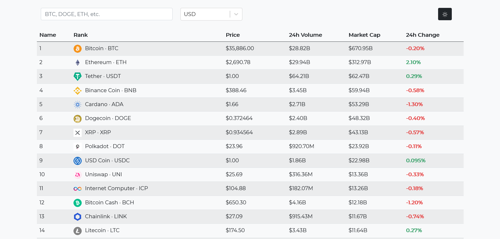
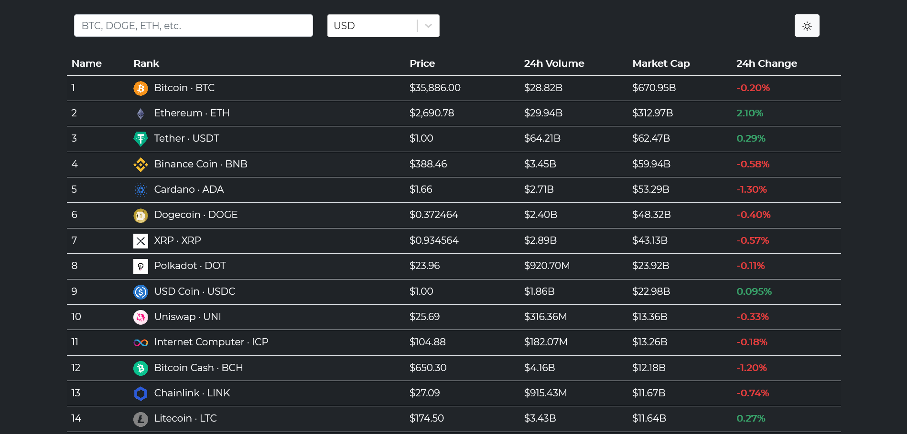

# Cryptocurrency Price Tracker Dashboard

A price tracker for top 100 cryptocurrencies based on [CoinGecko](https://www.coingecko.com/en). Displays the price, 24h Volume, market cap, and 24h Change with the table.

[Live Preview](https://cryptodashboardsprimm.netlify.app/)

## Preview
### Light mode

### Dark mode

## Features
+ Currency switching
+ Search by crypto name
+ Frequent in-browser price changes
+ Toggle dark/light mode

## Built with:
- [ReactJS](https://github.com/facebook/react/) for composing the UI
- [Bootstrap 5](https://getbootstrap.com) for styling
- [SWR](https://github.com/vercel/swr) for fast data fetching from [CoinGecko](https://www.coingecko.com/en) API
- [react-select](https://github.com/jedwatson/react-select) for Currency select options 
- [local-storage-fallback](https://github.com/ripeworks/local-storage-fallback) for local storage adapter

## Data courtesy of: 
-  [CoinGecko](https://www.coingecko.com/en)

## Design Inspiration from:
- [Ralabs @ Dribbble](https://dribbble.com/shots/11523666-Xchange-Table-Density-for-Crypto-Platform)

## Upcoming Features
- [ ] Add column in table for price change in Last 7 days
- [ ] Add a line graph in Last 7 Days displaying the change in price for each crypto in the table
- [x] Add support for more currencies